# 小児科向け当日診療予約Webアプリ（職業訓練グループワーク）

**使用技術：HTML / CSS / Java / Eclipse**

---

## 概要
職業訓練のグループワークで制作した、小児科で使用される想定のWebサイトです。  
患者が簡単に予約できるデザインを重視しました。

Webサイトから診療予約システムに遷移し、当日予約ができる仕様にしました。

---

## 当日予約システム仕様

当日予約システムについての確認

・予約時間  
午前診：9～10、10～11、11～12  
午後診：16～17、17～18  
各時間 **6人まで**

・予約受付可能時間  
当日の **朝6時から17時まで**

・予約受付条件  
開始時間になるまでの枠で受付可能  
（例：9～10の枠は **8:59まで受付可能**）

・取消について  
取り消しされても予約枠は増えない  
→ **DBでは論理削除で管理**

・予約状況の確認画面を追加

---

## 役割（自分の担当）

診療予約画面のバックエンド部分を主に担当しました。

・サーブレットを使用し、ログイン～予約完了までの処理を実装  
・JSPとの連携  
・データベースとの連携確認

---

## 工夫した点・課題

**工夫した点**

・入力項目を最小限にして、予約操作を簡単に  
・セッションのNullチェック機能を **Filterで実装し処理を共通化**  
・予約可能な時間帯のみ操作可能に制御  
・HTML画面から予約画面に遷移できるように設計  

**課題**

・チーム開発の時間が限られており、受付側の管理機能までは実装できなかった  
・通常の予約システムでは競合対策が実装されることが多いが、今回は省略  

---

## 画面キャプチャ

### トップページ

|トップページ|
|---|
|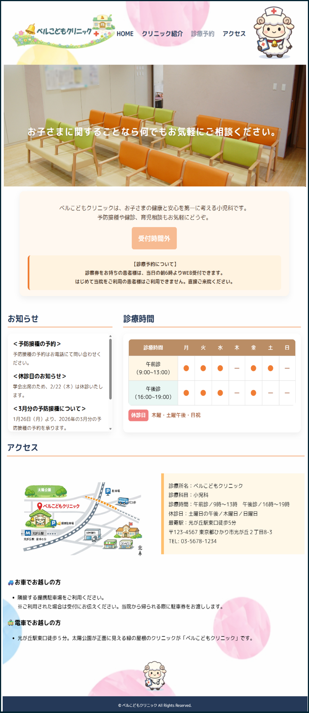|
|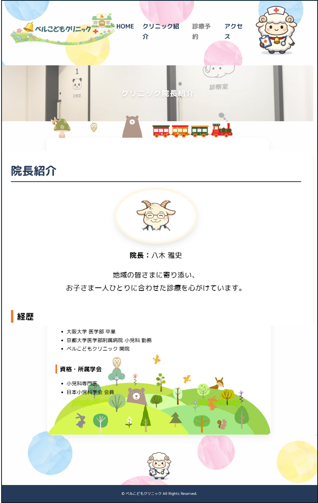|

---

### ログイン画面

|通常画面|エラー例|
|---|---|
|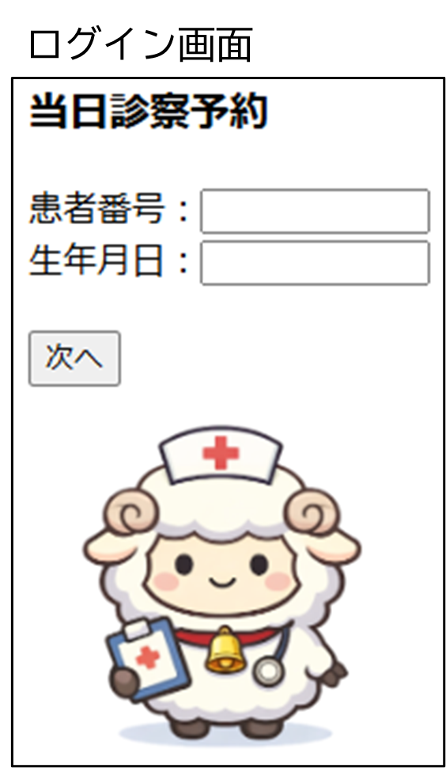|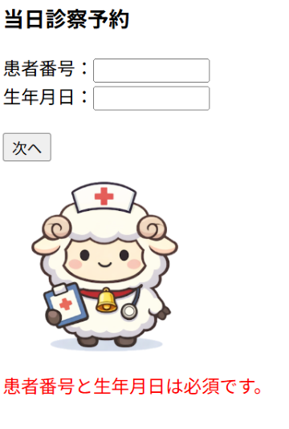|

|入力エラー|形式エラー|
|---|---|
|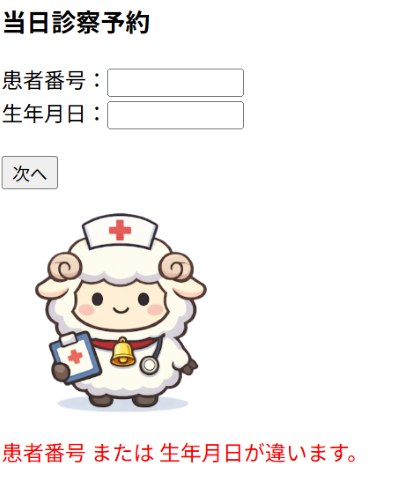|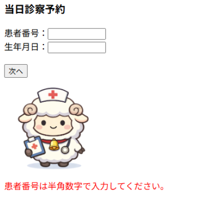|

|入力形式エラー|
|---|
|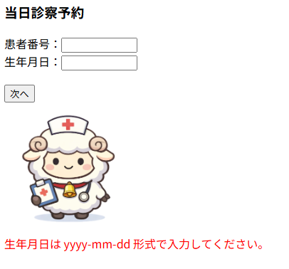|

---

### 予約画面

|予約画面|
|---|
|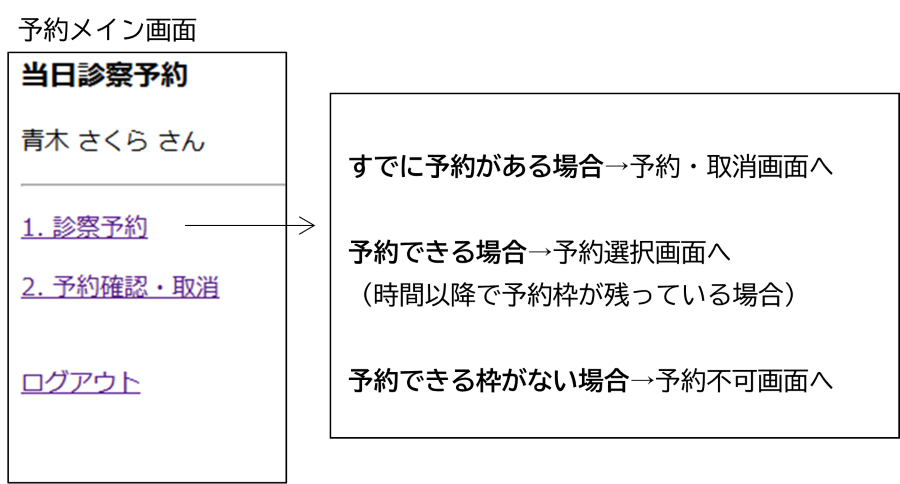|

---

### 予約確認・取消

|予約確認|
|---|
|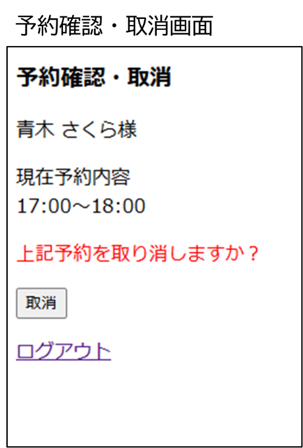|

---

### 予約時間選択

|予約時間選択|
|---|
|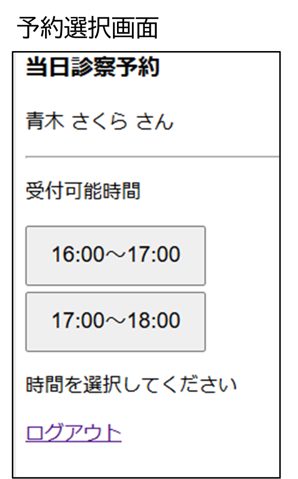|

---

### 予約不可画面

|予約不可|
|---|
|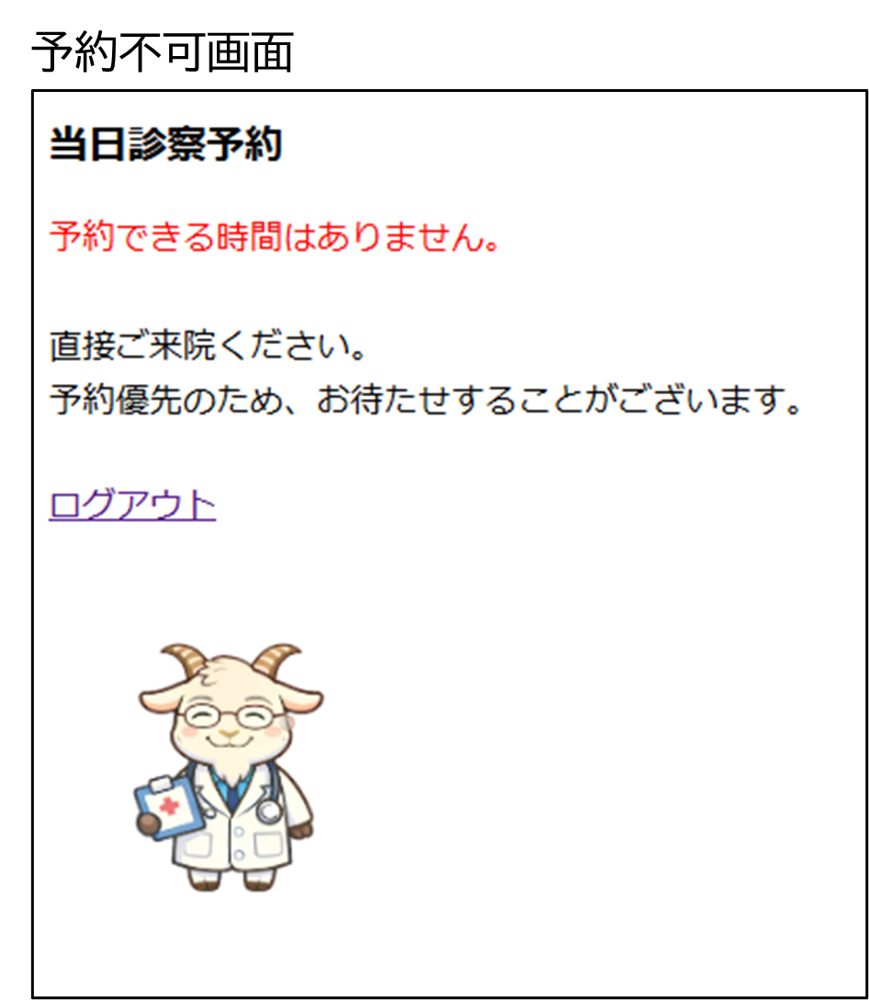|

---

### 予約取消完了

|取消完了|
|---|
|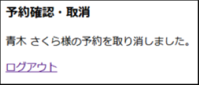|

---

## コード（GitHubリンク）

https://github.com/kstack-web/bell

---

## 学んだこと・まとめ

・HTML / CSS / Java / DAO / DB の基本的な連携  
・サーブレットとJSPの連携、画面表示の工夫  
・チームでの役割分担と開発の流れ  

特に結合作業では、仕様書の見落としや事前共有事項の不足により手戻りが発生しました。  

その経験から、

・制限時間内で優先度の高い機能に集中すること  
・スケジューリングの大切さと難しさ  

を実感しました。
